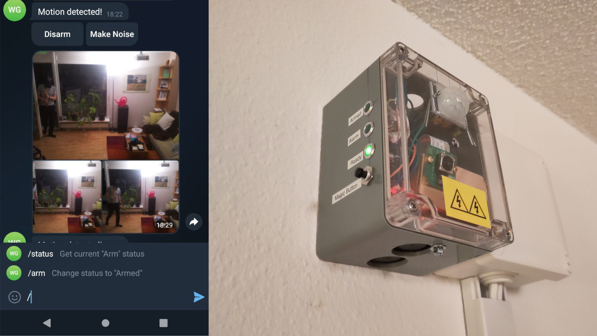
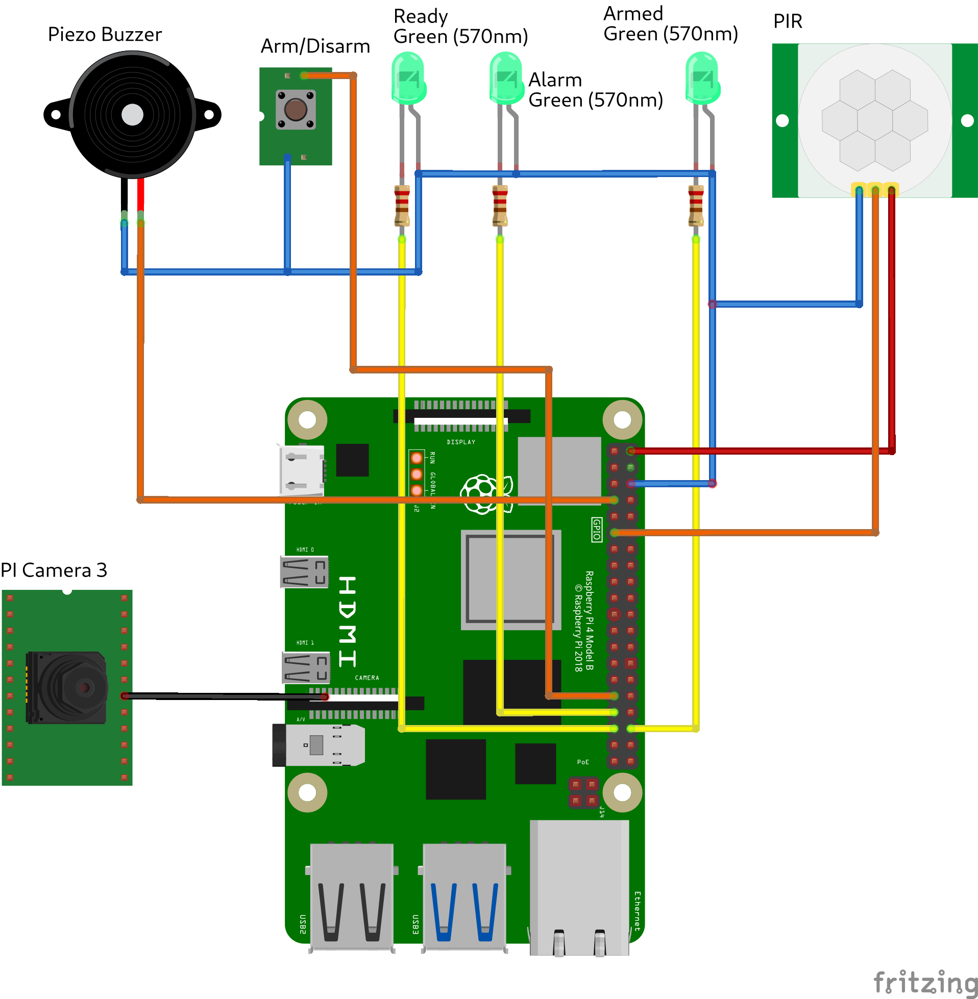

# Raspberry PI Alarm

Yet another Raspberry PI alarm system. It monitors an area using a passive infrared sensor and if motion is detected,
the camara captures 4 pictures which are then sent to a configurable Telegram group or user.
Moreover, the system's main functions are controlled using a Telegram bot. In order to further bring down the number of
_ghosts_ (aka false positives), SSIM is used to measure the similarity of the captured images and notification is inhibited
if not meeting the configurable threshold value.



## Tech stack

The main program builds upon Python's `asyncIO` library and is using [aiogram3](https://aiogram.dev/) to interact with
Telegram, [picamer2](https://github.com/raspberrypi/picamera2) to control the camera and finally [pigpio](https://abyz.me.uk/rpi/pigpio/index.html) for interfacing
with the GPIO.

## Used hardware

- Raspberry PI 4 (Raspi5 untested)
- Camera Module 3
- Passive infrared motion sensor
- Physical push button
- Leds and corresponding resistors
- Enclosure
- Raspberry PI relays board
- (Optional) Piezo Buzzer

## Setup

- Get your telegram bot token by talking with [@botfather](https://t.me/botfather)
- Create group, [get group ID](https://stackoverflow.com/a/32572159)
- Add your bot to this group
- Clone this repository and install requirements:
  ```bash
  # Install OS requirements
  sudo apt install -y python3-libcamera python3-kms++
  sudo apt install -y python3-prctl libatlas-base-dev ffmpeg libopenjp2-7 python3-pip libcap-dev
  
  # Enable "remote GPIO"
  # raspi-config->Interface Options -> Remote GPIO
  
  # Enable pigpiod service on boot
  sudo systemctl enable pigpiod
  
  # Create a new python virtual env inside the cloned repository
  python3 -m venv --system-site-packages venv
  
  # Activate venv
  source venv/bin/activate
  
  # install requirements
  pip install -r requirements.txt
  
  # Edit .env.dist and copy
  cp .env.dist .env
  ```
- Adjust the [systemd service file](scripts/raspi-alarm.service) and copy to `/usr/lib/systemd/system`
- Enable on boot: `sudo systemctl enable raspi-alarm.service`

## Wiring




## Closing words

This software was written with the best of intentions and I take no responsibility for any potential damage resulting from its use. 
Feel free to study, use and adapt. 

